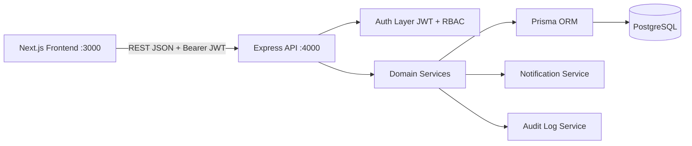
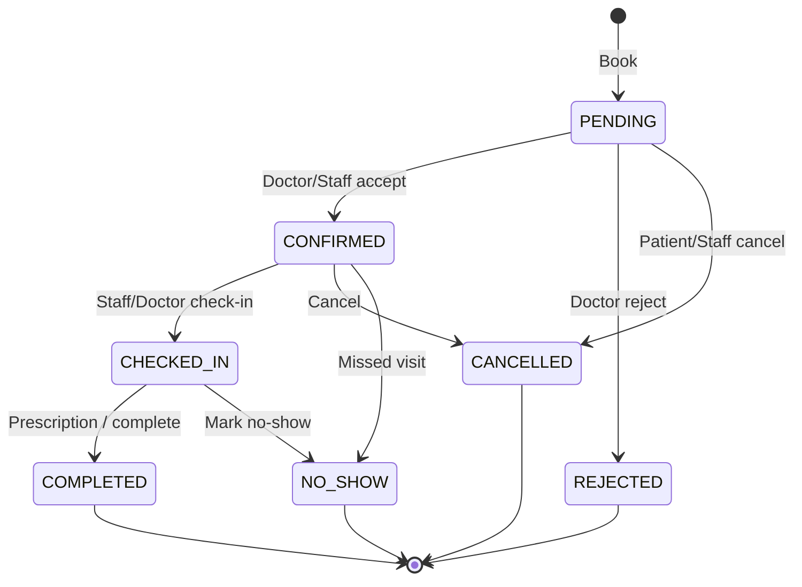

# 02 — Architecture

## High-level diagram



## Backend layers

```
HTTP Request
  → routes/            thin route definitions
  → middlewares/       authenticate, authorize, rate limit, error
  → controllers/       parse Zod, call service, send response
  → services/          business rules
  → prisma/            database access
  → responses/         success / error envelopes
```

### Why this shape

- Controllers stay thin and testable
- Services own business rules (booking conflicts, RBAC scope, billing math)
- Prisma schema is the single source of truth for data
- Soft deletes (`deletedAt`) protect historical clinical records

## Frontend architecture

```
app/                 App Router pages (public + dashboards)
components/          Shared UI (DashboardShell, StatCard, …)
contexts/            AuthProvider + useRequireAuth
services/api.ts      Domain API clients (axios)
lib/api.ts           Axios instance + token refresh queue
lib/utils.ts         Formatting helpers
config/              App constants / role home routes
types/               Shared TypeScript contracts
```

### Auth on the client

1. Login stores `accessToken` + `refreshToken` in `localStorage`
2. Axios attaches `Authorization: Bearer <access>`
3. On `401`, refresh is attempted once (queued for concurrent requests)
4. Role dashboards call `useRequireAuth([...roles])`

## Appointment lifecycle



### Status ownership

All status changes go through `backend/src/domain/appointment-status.ts` (`assertAppointmentStatusChange`). Controllers/services must not invent alternate transition rules. Admin/Super Admin may override for operational recovery; other roles are bound to the transition graph + role permissions.

## Cross-cutting concerns

| Concern | Implementation |
|---------|----------------|
| Config | `backend/src/config/env.ts` (Zod-validated) |
| Errors | `AppError` hierarchy + central `errorHandler` |
| Audit | `auditService.log(...)` on create/update/delete/login |
| Notifications | In-app rows in `notifications` table |
| Pagination | `getPagination(req)` helper |

## Scalability notes

- Services can later emit events (queue) for email/SMS without changing controllers
- File uploads folder is ready; swap to S3/Cloudinary behind a storage service
- API is versioned under `/api/v1` for non-breaking evolution
