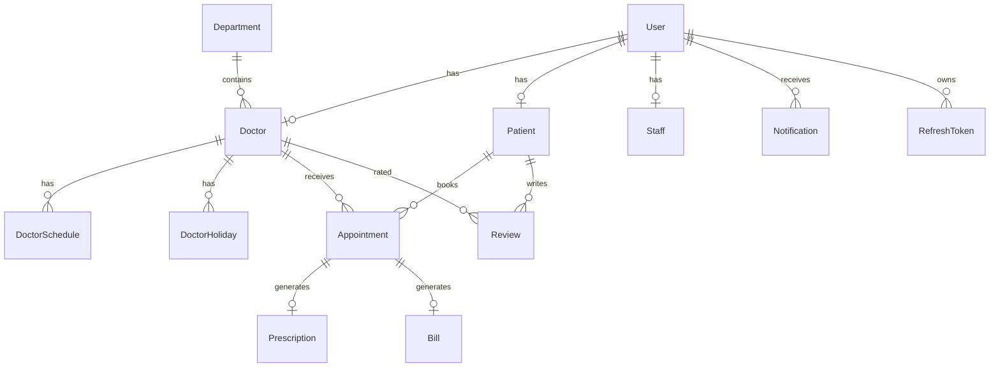

# 03 — Database Design

## Provider

PostgreSQL via Prisma. Schema: `backend/prisma/schema.prisma`.

## Entity relationship (logical)

## Core tables

### `users`
Identity for all roles. Fields: `name`, `email`, `password` (bcrypt), `role`, `phone`, `status`, `emailVerified`, soft delete.

### `doctors` / `patients` / `staff`
Role profiles linked 1:1 to `users`.

### `departments`
Clinical specialties (Cardiology, Pediatrics, …).

### `doctor_schedules` / `doctor_holidays`
Weekly availability windows + holiday dates used by slot generation.

### `appointments`
Visit record: doctor, patient, date, start/end time, status, queue number, reason/notes.

### `prescriptions`
Diagnosis, medicines (JSON), tests (JSON), notes, follow-up date. One per appointment.

### `bills`
Consultation / medicine / lab / other charges, discount, tax, totals, payment status/method.

### `notifications`
In-app alerts keyed by `user_id`.

### `reviews`
Patient rating of a doctor (unique per doctor+patient).

### `audit_logs` / `refresh_tokens` / `token_blacklist` / `system_settings`
Security and ops support tables.

## Important enums

| Enum | Values |
|------|--------|
| `Role` | SUPER_ADMIN, ADMIN, DOCTOR, PATIENT, STAFF |
| `AppointmentStatus` | PENDING, CONFIRMED, CHECKED_IN, COMPLETED, CANCELLED, REJECTED, NO_SHOW |
| `PaymentStatus` | PENDING, PAID, PARTIAL, REFUNDED, FAILED |
| `PaymentMethod` | CASH, CARD, UPI, ONLINE, INSURANCE |
| `UserStatus` | ACTIVE, INACTIVE, SUSPENDED, PENDING_VERIFICATION |

## Conventions

- IDs: `cuid()`
- Money: `Decimal(10,2)` mapped to numbers in API DTOs
- Soft delete: filter `deletedAt: null` in queries
- Indexes on FKs, status, email, appointment date

## Seed data

`backend/prisma/seed.ts` creates departments, demo users, sample appointments, a paid bill, a prescription, and notifications.
